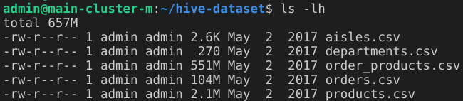
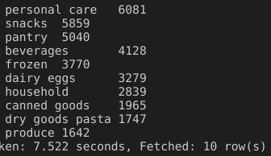
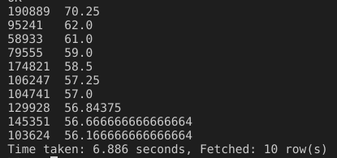
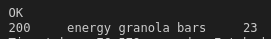
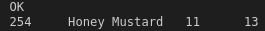
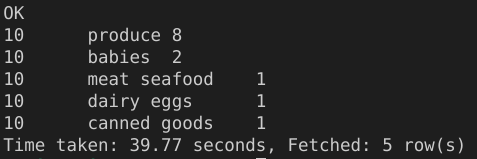

<h2 align="center">Mise en place d'un Data Warehouse sur Apache Hive</h2>


<div align="center"></div>

<h2 align="center">François Legland</h2>

## À propos du projet

### Description

Une entreprise qui livre des produits frais à domicile cherche à migrer son Data Warehouse d'une base PostgreSQL vers Apache Hive pour des raisons de montée en charge. En effet, elle prédit que dans les prochains mois, la taille des données stockées pourrait être multipliée par 50, ce qui ferait considérablement ralentir les temps d'exécutions des requêtes si elle restait sur PostgreSQL.

Cette base de données est un extrait afin de faire des opérations analytiques afin de comprendre les comportements des clients. En particulier, l'entreprise cherche à optimiser les commandes afin d'augmenter le prix du panier moyen. Il est donc prévu que le Data Warehouse supporte de nombreux requêtes d'analyses poussées, et notamment de jointure entre les différentes tables de données.

### Contraintes

Le Data Warehouse construit lors de ce projet va être utilisé par de nombreux acteurs, aussi bien des Data Analysts pour du reporting, que par des Data Scientists pour construire des modèles prédictifs ou les métiers pour des besoins internes. Par conséquent, il y a plusieurs contraintes à respecter.

* L'ensemble des requêtes réalisées doivent être documentées et historisées. On pourra alors utiliser GitHub pour centraliser l'ensemble des requêtes, et écrire des fichiers Markdown pour documenter les différentes étapes du projet.

* Le stockage des données sur Apache Hive doit être optimisé et partitionné pour réduire au maximum les temps d'exécutions des requêtes futures.

## Étapes de réalisation

### 0. Clôner le dépôt git

```bash
git clone https://github.com/FrancLgd/PUBLIC-Projet-Data-Engineering-Datawarehouse-Hive.git
cd PUBLIC-Projet-Data-Engineering-Datawarehouse-Hive
```

### 1. Charger les données dans une base Hive

#### 1.1 Transférer le fichier zip sur le serveur Dataproc

Premièrement, nous transférons sur le serveur Dataproc le fichier `./data/hive-data-warehouse-dataset.zip` contenant les tables à importer dans Hive. Ceci est réalisé grâce à la commande suivante :

```bash
scp ./data/hive-data-warehouse-dataset.zip admin@34.76.126.254:/home/admin/
```

Nous nous connectons ensuite en SSH au serveur Dataproc puis y dézippons le fichier transféré.

```bash
ssh admin@34.76.126.254
unzip hive-data-warehouse-dataset.zip
```

Les fichiers csv alors obtenus dans le dossier `/home/admin/hive-dataset` sont listés dans la capture ci-dessous.

<div style="text-align:center;">
    
</div>

#### 1.2 Importer les données dans Hive

Après avoir transférer notre dossier `./src` sur le serveur via la commande

```bash
scp -r ./src admin@34.76.126.254:/home/admin/
```

nous y lançons le script `./src/create_database_and_tables.hql` comme suit.

```bash
hive -f ./src/create_database_and_tables.hql
```

Dans ce script, après avoir initialisé la base, pour chaque table nous importons les données au format CSV puis  les convertissons vers une table au format ORC. Ce dernier est en effet un format plus adapté à nos futures requêtes de type OLAP.

### 2. Construire les tables d'analyse

Nous construisons tout d'abord la table `aisles_products`. Elle dénombre le nombre d'articles dans chaque catégorie, et est créée par la commande ci-dessous.

```sql
CREATE TABLE freshness.aisles_products AS
(
    SELECT 
        a.aisle_id,
        a.aisle,
        COUNT(p.product_id) AS product_count
    FROM 
        freshness.aisles a
    LEFT JOIN 
        freshness.products p ON a.aisle_id = p.aisle_id
    GROUP BY 
        a.aisle_id, a.aisle
    ORDER BY 
        product_count DESC
);
```

La figure qui suit permet de visualiser les premières lignes de cette table. Nous y observons que la catégorie avec le plus d'articles est la catégorie 'missing', autrement dit ce qui regroupe les articles non-catégorisés. La "vraie" catégorie la plus représentée est la 'candy chocolate', avec 1146 articles, suivie par 'ice cream' qui en dénombre 1043, etc.

<div style="text-align:center;">
    
</div>


La seconde table, `departments_products`, vise à dénombrer le nombre d'articles dans chaque département. Elle est créée par la commande ci-dessous.

```sql
CREATE TABLE freshness.departments_products AS
(
    SELECT 
        d.department_id,
        d.department,
        COUNT(p.product_id) AS product_count
    FROM 
        freshness.departments d
    LEFT JOIN 
        freshness.products p ON d.department_id = p.department_id
    GROUP BY 
        d.department_id, d.department
    ORDER BY
        product_count DESC
);
```

La figure ci-dessous donne à voir les premières lignes de cette table `departments_products`. Nous y remarquons que les départements les plus représentés en termes d'articles sont respectivement 'personal care' (avec 6081 articles), 'snacks' (5859 articles), 'pantry' (5040), etc.

<div style="text-align:center;">
    
</div>

Enfin, nous voulons une table `orders_per_users` dénombrant le nombre d'articles moyen par commande, et ce pour chaque utilisateur. Ceci est réalisé grâce à la requête qui suit. Elle prend environ 80 secondes à aboutir.

```sql
CREATE TABLE freshness.orders_per_users AS
(
    SELECT 
        user_id,
        COUNT(op.product_id) / COUNT(DISTINCT o.order_id) AS avg_products_per_order
    FROM 
        freshness.orders o
    JOIN 
        freshness.order_products op ON o.order_id = op.order_id
    GROUP BY 
        user_id
    ORDER BY
        avg_products_per_order DESC
);
```

Sur la figure ci-dessous sont listés les utilisateurs dont le nombre moyen d'articles par commande sont les plus élevés.

<div style="text-align:center;">
    
</div>

### 3. Réaliser les requêtes pré-constuites

Dans l'optique de faire gagner du temps aux équipes métiers, nous souhaitons disposer de requêtes pré-enregistrées de sorte que celles-ci puissent s'exécuter en modifiant au besoin un ou deux paramètres d'entrée. Pour ce faire, nous avons développé :
* `./src/best_category.hql` : pour un utilisateur donné (cf. paramètre `user_id` en entrée), elle donne le nom de la catégorie pour laquelle il y a eu le plus d'achats parmi toutes les commandes passées;
* `./src/best_hour.hql` : pour un article donné (cf. paramètre `product_name` en entrée), elle détermine à quelle heure il a été le plus acheté;
* `./src/orders_department_count.hql` : pour une commande donnée, elle détermine le nombre d'articles acheté par département.

Nous montrons ci-dessous un exemple d'utilisation et de sortie de ces scripts (après les avoir transférés sur le serveur avec la commande `scp` habituelle).

```bash
hive -f ./src/best_category.hql --hiveconf user_id=200
```

<div style="text-align:center;">
    
</div>

```bash
hive -f ./src/best_hour.hql --hiveconf product_name="'Honey Mustard'"
```

<div style="text-align:center;">
    
</div>

```bash
hive -f ./src/orders_department_count.hql --hiveconf order_id=10
```

<div style="text-align:center;">
    
</div>

#### 3.2 Tests d'optimisation

CSV Time taken (Elapsed Time) vs ORC Time taken ORC (Elapsed Time) vs ORC avec Partion (Elapsed Time)

best_category : 38sec (21) vs 32 (16) sec vs 82 (62)
best_hour : 32sec (15) sec vs 26sec (8) 48 (29)
orders_departement_count : 33sec (16)  vs 32sec (14) vs 46 (26) 

### 4. Définir la requête de la base d'apprentissage pour le Machine Learning

Les Data Scientists vont devoir construire des modèles prédictifs afin d'optimiser la vente des articles. Pour cela, ils souhaitent disposer d'une requête SQL qui peuvent exécuter quand ils ont besoin de récupérer toutes les informations depuis Hive. Cette requête doit retourner une table de données où chaque ligne correspond à un article d'une commande, et disposer des informations suivantes :
* des informations d'identification de l'article, de la commande et de la catégorie;
* du nom de l'article et de la catégorie;
* de toutes les informations temporelles connues dans le Data Warehouse concernant les articles ou les commandes;
* de toutes les informations concernant les utilisateurs.

Cette requête est écrite dans le fichier `./src/ml_table .sql`.


